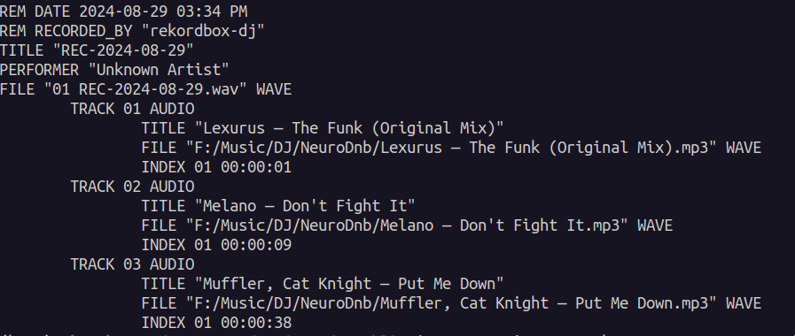
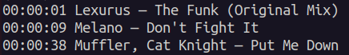

## Tracklist
Read tracklist from your DJ software in YouTube friendly format

Before:


After:


## How to use
Build for your OS, or grab from [Releases](https://github.com/mihsamusev/tracklist/releases) and use as a command line
```bash
 build -o tracklist
./tracklist recordbox.cue 
./tracklist mixxx.cue 
```

Try simple filtering
```bash
./tracklist mixxx.cue "(delete me),[DELETEME]"

```
